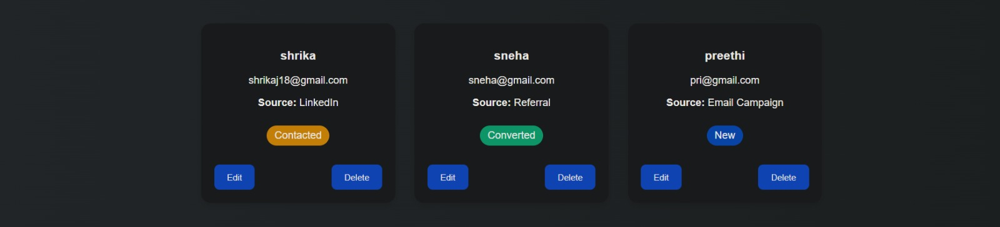
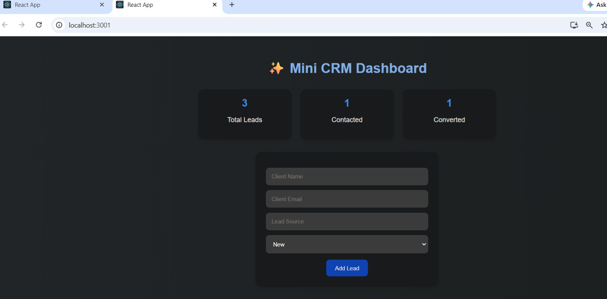

# Mini CRM Dashboard

A modern Mini CRM Dashboard built using React.js, Node.js, and Express.js with full CRUD functionality.

## 🚀 Live Demo
https://future-fs-02-beryl.vercel.app/

## 🚀 Features
- Add Leads
- Edit Leads
- Delete Leads
- Dashboard Analytics
- Responsive UI
- Full CRUD Operations

## 🛠 Tech Stack
- React.js
- Node.js
- Express.js
- JSON Storage

## ▶ Run Frontend

cd client
npm start

## ▶ Run Backend

cd server
npx nodemon server

## 📸 Screenshots

### Dashboard

### CRUD Operations

